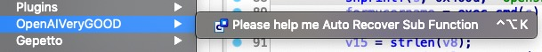

# Away_From_Sub_Function_IN_IDA

Use openai to help you better translate function meanings and restore symbol tables from sub_xxxx functions in IDA Pro.

## Usage

Download the `.py` script file and push it to `plugins` directory in your IDA Pro. If your work environment is MasOS, the location will be:

```
%Your_IDA_PATH%/ida.app/Contents/MacOS/plugins/
```

such as:

```
➜  plugins pwd
/Volumes/Work/IDAPro_7.5/ida.app/Contents/MacOS/plugins
➜  plugins ls
Away_From_Sub_Function_IN_IDA.py binexport11.dylib                defs.h                           hexmips.dylib                    mac_stub.dylib                   pin_user.dylib                   swift.dylib
helpp.py                binexport1164.dylib              dscu.dylib                       hexrays.dylib                    mac_stub64.dylib                 pin_user64.dylib                 swift64.dylib
_patch.dSYM                      bochs                            dscu64.dylib
```

And open IDA Pro, choose `Edit->OpenAIVeryGOOD->Please help me Auto Recover Sub Function` to automatic restore `sub_xxx` function's symbol and translate function meaning, there need to wait...(Depends on the number of your sub_xxx functions.)



The script translates pseudocode below 70 lines, and rename `sub_xxx` function to an easier to understand function name.


- Modify `MAX_LINE_TOKEN` in `.py` file to translate more functions, but if pseudocode hava too many lines, openai may not to translate.

The final restored effect can be seen in the `Functions Window` on the left.


